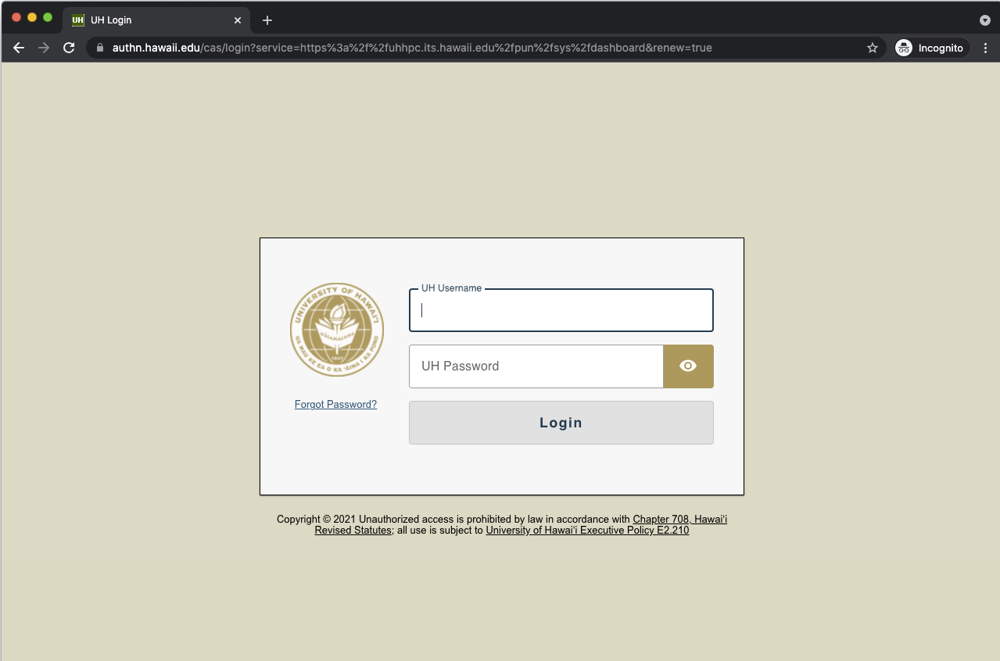
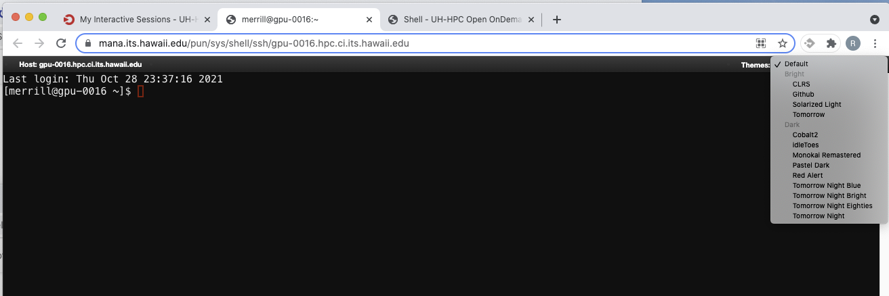

## Lets get started!
You should have the following...
* Have an account on Mana
* Have UH Duo/MFA enabled
* Be able to connect to the workshop in Zoom and Mana Open OnDemand via a web browser
* Have a GitHub account

## Connect to Mana through Open OnDemand
Connect to Mana by pointing your browser (ChromeOS, Firefox or Safari) at 

[mana.its.hawaii.edu][mana-ood]

You should get the UH gold screen and then login with your user name and password. 
 

Authenticate with MFA/DUO via your preferred method.

You should see the Mana Open OnDemand start page

## Launch an interactive session on a compute node
Start an interactive session

## Your compute node is assigned.
Start a shell...

Answer
	yes

Warning: Permanently added 'gpu-0016.hpc.ci.its.hawaii.edu,10.100.11.214' (ECDSA) to the list of known hosts.
Authentication failed.
Your connection to the remote server has been terminated.

Go back to my interactive sessions in the browser and start another shell..

Change the terminal theme if you like.  You can do that anytime.

Download [data-shell.zip] to your home directory.

wget https://ci-tracs.github.io/Scientific_Software_Basics/data/data-shell.zip

unzip data-shell.zip

[mana-ood]: https://mana.its.hawaii.edu
[zip-file]: {{ page.root }}/data/data-shell.zip

